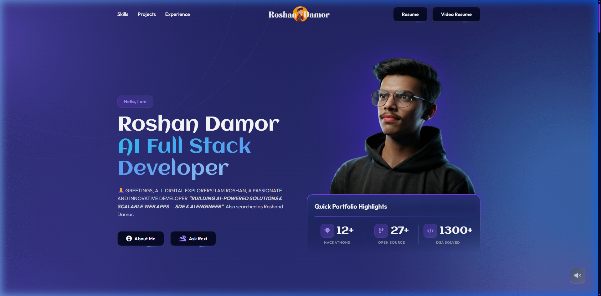
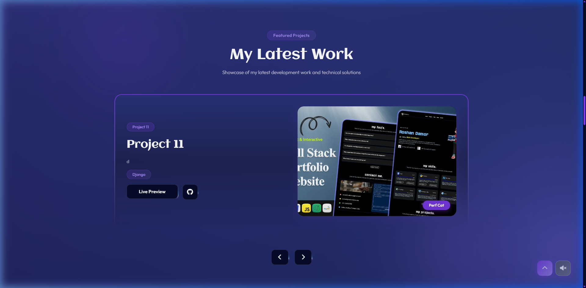
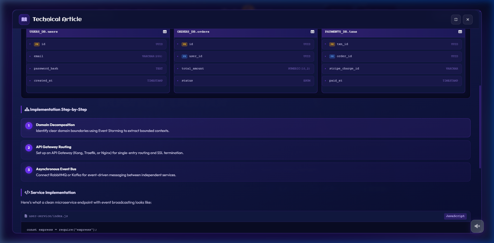
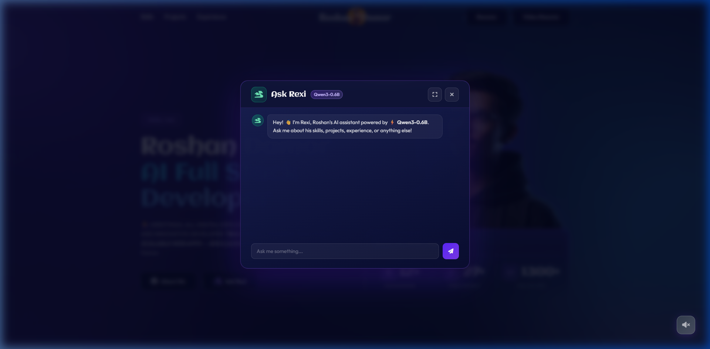
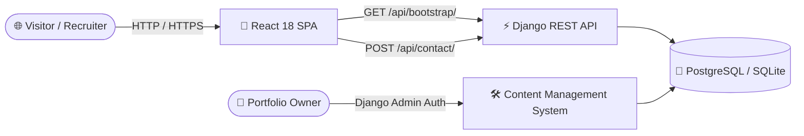
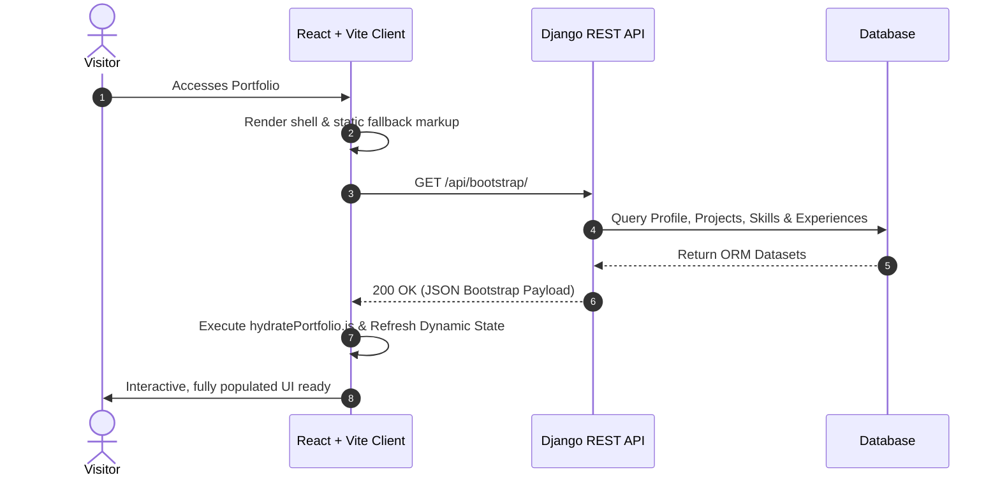
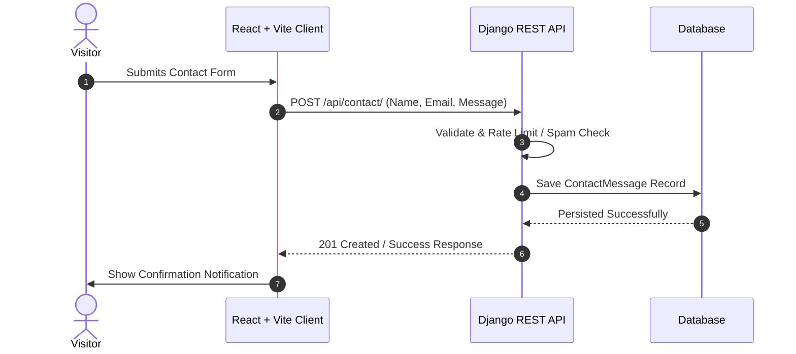

<div align="center">
  
  <h1>🚀 Roshan Damor — Software Engineer Portfolio</h1>
  <p><b>A production-oriented personal portfolio platform built with React, Vite & Django REST Framework</b></p>

  <p>
    <a href="https://logicbyroshan.in">
      
    </a>
    <a href="https://www.djangoproject.com/">
      
    </a>
    <a href="https://react.dev/">
      
    </a>
    <a href="https://vitejs.dev/">
      
    </a>
    <a href="https://www.python.org/">
      
    </a>
  </p>
</div>

---

## 🌟 Visual Preview & Showcase

<table width="100%">
  <tr>
    <td width="50%" align="center">
      <b>✨ Interactive Hero & Glassmorphic UI</b><br/><br/>
      
    </td>
    <td width="50%" align="center">
      <b>💻 Dynamic Projects Showcase</b><br/><br/>
      
    </td>
  </tr>
  <tr>
    <td width="50%" align="center">
      <b>📖 Technical Documentation & ER Diagrams</b><br/><br/>
      
    </td>
    <td width="50%" align="center">
      <b>🤖 Ask Rexi — AI Assistant</b><br/><br/>
      
    </td>
  </tr>
</table>

---

## 🎯 Executive Overview

This repository contains the source code for my personal software engineering portfolio — a production-oriented web application designed to present projects, technical experience, engineering work, and professional information through an interactive interface.

The system combines a React + Vite client with a Django REST backend and a database-driven content management workflow. Instead of relying entirely on static portfolio content, the application exposes structured data through APIs and allows portfolio information to be managed from the backend.

### Key Highlights

- **⚛️ React + Vite Application**: Interactive client-side application with reusable UI components, dynamic content rendering, responsive layouts, and optimized builds.
- **⚡ API-Driven Architecture**: Portfolio content is retrieved through a centralized bootstrap API and transformed into the frontend application at runtime.

---

## 🏗️ System Architecture & Data Flow

### 1. High-Level Context Diagram



### 2. Monorepo Request & Hydration Lifecycle



### 3. Contact Request Flow



---

## 🚀 Feature Spotlight

### 1. Interactive Portfolio Experience
- Responsive portfolio interface
- Custom dark glassmorphic design system
- Interactive hero and project sections
- Dynamic project and experience rendering
- Modal-based content presentation
- Responsive desktop and mobile layouts
- Smooth UI transitions and micro-interactions

### 2. 📖 Technical Documentation & Article Viewer
- Interactive technical documentation viewer
- Sticky fullscreen documentation header
- Database ER diagram visualization
- Entity relationship cards
- Primary key (PK) and foreign key (FK) indicators
- Technical step cards
- Alert and callout components
- Syntax-highlighted code blocks
- Fullscreen reading mode

### 3. 🤖 Ask Rexi — AI Assistant Integration

Ask Rexi provides an interactive AI interface that allows recruiters and visitors to explore portfolio information conversationally.

The assistant can be used to understand:
- Projects
- Technical skills
- Engineering experience
- Development background
- Technologies used
- Professional profile

The goal is to make the portfolio an interactive technical profile rather than only a collection of static pages.

### 4. 🗂️ Content Management System

The Django administration interface provides authenticated management for:
- Projects
- Skills
- Experience
- Articles
- Profile information
- Contact messages
- Portfolio content

This separates portfolio content from frontend presentation logic and allows routine content updates without modifying the frontend application.

### 5. ⚡ Dynamic API Hydration

The frontend initializes its dynamic content through:

```http
GET /api/bootstrap/
```

The bootstrap response provides the structured datasets required to populate the application.

A local fallback mechanism is also available so the interface can maintain a usable initial state when the API is unavailable.

### 6. 🔎 SEO & AI Discoverability

The application includes:
- `sitemap.xml`
- `robots.txt`
- `llms.txt`
- OpenGraph metadata
- JSON-LD structured data
- `Person` schema
- `WebSite` schema
- Dynamic page metadata

These features make the portfolio easier for search engines, crawlers, and AI-powered systems to understand.

---

## 📁 Repository Structure

```text
Code Portfolio/
├── client/                         # React + Vite Frontend
│   ├── public/
│   │   ├── portfolio-body.html    # Main DOM structure & modal definitions
│   │   └── static/
│   │       ├── css/                # Modular stylesheets
│   │       ├── js/                 # Client-side interaction engines
│   │       └── images/             # Screenshots, logos & project assets
│   │
│   ├── src/
│   │   ├── api/                    # API client & portfolio hydration
│   │   ├── App.jsx                 # React application wrapper
│   │   └── main.jsx                # Vite application entry point
│   │
│   └── package.json
│
├── server/                         # Django REST Backend
│   ├── portfolio/                  # Models, serializers & API views
│   ├── server/                     # Settings & URL configuration
│   ├── manage.py
│   └── requirements.txt
│
└── README.md                       # Project documentation
```

---

## ⚙️ Local Development Setup

### Prerequisites
- **Node.js**: `v18.x` or higher
- **Python**: `v3.11` or higher
- **Git**

### 1. Backend Setup

```bash
# Navigate to backend
cd server

# Create virtual environment
python -m venv .venv

# Windows
.venv\Scripts\activate

# macOS / Linux
source .venv/bin/activate

# Install dependencies
pip install -r requirements.txt

# Apply migrations
python manage.py migrate

# Create Django admin account
python manage.py createsuperuser

# Start backend server
python manage.py runserver
```

### 2. Frontend Setup

Open a new terminal:

```bash
# Navigate to frontend
cd client

# Install dependencies
npm install

# Start Vite development server
npm run dev
```

### Local Services

- **Frontend**: [http://localhost:5173](http://localhost:5173)
- **Backend**: [http://localhost:8000](http://localhost:8000)
- **Django Administration**: [http://localhost:8000/admin](http://localhost:8000/admin)

---

## 🔒 Security & Performance Features

### Security
- **CORS Protection** — Controlled origin configuration for API access
- **CSRF Protection** — Django CSRF safeguards for state-changing requests
- **API Validation** — Backend validation for incoming payloads
- **Rate Limiting** — Protection against excessive contact requests
- **Duplicate Suppression** — Reduction of repeated and spam submissions
- **Authentication** — Protected administrative operations
- **Environment Configuration** — Sensitive configuration kept outside source control

### Performance
- **Vite Build Pipeline** — Optimized frontend development and production builds
- **Lazy-loaded Media** — Reduced initial media loading cost
- **WebP Assets** — Optimized image delivery
- **API-driven Hydration** — Structured content loading through a centralized endpoint
- **Nginx + Gunicorn** — Production HTTP request handling
- **Dockerized Deployment** — Consistent application runtime

---

## 🧠 Engineering Decisions

### Why React + Vite?

The portfolio requires a highly interactive frontend with reusable UI components, dynamic content, client-side interactions, and responsive rendering.

Vite provides a fast development environment and an efficient production build pipeline.

### Why Django + Django REST Framework?

Django provides the backend foundation for:
- Database modeling
- Authentication
- Administration
- Security middleware
- Business logic
- Content management

Django REST Framework provides the API layer consumed by the React application.

### Why API-Driven Content?

Portfolio content is separated from the presentation layer:

```text
Portfolio Content
       ↓
 Django Models
       ↓
Django REST API
       ↓
React Application
       ↓
 Interactive UI
```

This allows portfolio data to be maintained independently of frontend presentation code.

### Why a Bootstrap Endpoint?

The portfolio requires several datasets during initialization:
- Profile
- Projects
- Skills
- Experience
- Articles
- Other structured content

A centralized bootstrap response provides a predictable initialization flow while reducing unnecessary initial API requests.

---

## 📊 Engineering Focus

This project demonstrates practical engineering across:
- Application architecture
- REST API design
- Frontend engineering
- Backend engineering
- Database-backed systems
- Authentication and authorization
- API validation and throttling
- Dynamic data hydration
- AI integration
- SEO and structured metadata
- Security considerations
- Containerized deployment
- Production web infrastructure

---

## 🔭 Future Improvements

Planned improvements include:
- Expanded AI assistant capabilities
- More advanced portfolio knowledge retrieval
- Improved application observability
- Automated testing and CI/CD improvements
- Performance profiling and optimization
- Expanded technical documentation
- More structured AI-readable project metadata
- Additional interactive engineering demonstrations

---

## 📝 License

Distributed under the **MIT License**.

See `LICENSE` for details.

<div align="center">
  <sub>Built with ❤️ by <a href="https://github.com/logicbyroshan">Roshan Damor</a></sub>
</div>
